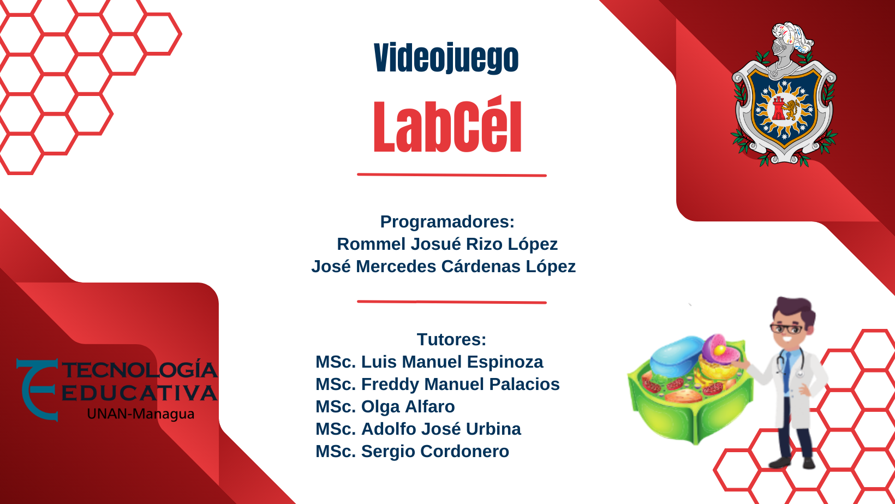

# Labcél 🧬🎮

## Introducción
¡Bienvenido a Labcél! Este es un emocionante videojuego centrado en el mundo microscópico de las células, donde tu objetivo es comer nutrientes 🍏🍞 y evitar virus 🦠 que afectan a las células. Prepárate para sumergirte en una aventura llena de desafíos y estrategia celular.

## Objetivo del Manual 📖🎯
Este manual tiene como objetivo proporcionarte toda la información necesaria para jugar Labcél de manera efectiva. Aquí encontrarás instrucciones sobre cómo utilizar las principales funciones del juego, así como soluciones a problemas comunes y respuestas a preguntas frecuentes.

## Audiencia 🎮👥
Este manual está dirigido a los jugadores de Labcél, tanto nuevos como experimentados, que deseen comprender mejor las mecánicas del juego, aprender a utilizar las funciones principales y resolver posibles problemas. También se incluye una sección para aquellos interesados en obtener información adicional y datos de contacto.

Audiencia opcional: Desarrolladores interesados en conocer más detalles técnicos sobre el juego y su implementación.

## Alcance 🚫🔍
Es importante tener en cuenta que este manual se centra en el uso del juego Labcél y no abarca aspectos relacionados con el desarrollo o la personalización del juego. Cualquier información fuera del alcance de este manual puede ser consultada a través de los recursos proporcionados en la sección de preguntas frecuentes.

## Guía de Uso 📚💡
Aquí tienes un video de presentación que muestra la jugabilidad y las características de Labcél:

1. Inicio del juego
2. Controles
3. Comer nutrientes
4. Evitar virus

   👇 Clic aca 👇

# Instalación
poseer el apk y proceder a instalar

# Estrategias
Planifica tu movimiento estratégicamente para evitar áreas peligrosas.

## Solución de Problemas ❗🔧
En caso de encontrar algún problema o error durante la ejecución de Labcél, aquí se presentan algunos problemas comunes y sus posibles soluciones:
1. Problema: La célula del jugador se debilita rápidamente.
   - Solución: Asegúrate de consumir suficientes nutrientes para fortalecer tu célula y evitar los virus. Planifica tu movimiento estratégicamente para evitar áreas peligrosas.

2. Problema: El juego se congela o se bloquea.
   - Solución: Reinicia el juego y asegúrate de que tu dispositivo cumpla con los requisitos mínimos de sistema. Si el problema persiste, comunícate con nuestro equipo de soporte técnico (ver sección de preguntas frecuentes).

## Documentación 📄
El siguiente sitio web aloja la documentación de clases de nuestros Scripts, [labcel.x10.mx](http://labcel.x10.mx)

## Preguntas Frecuentes ❓🔍
Aquí se encuentran algunas preguntas frecuentes y sus respuestas para brindarte más ayuda e información adicional sobre Labcél:

**1. ¿Dónde puedo encontrar más ayuda o soporte técnico?**
Puedes visitar nuestro sitio web oficial en [labcel.x10.mx](http://labcel.x10.mx) para obtener más información y acceder a recursos adicionales. También puedes contactar a nuestro equipo de soporte técnico en support@labcél.com para obtener ayuda adicional.

**2. ¿Cómo puedo proporcionar comentarios o sugerencias sobre el juego?**
Valoramos tus comentarios. Puedes enviarnos tus sugerencias y comentarios a [WhatsApp ](https://api.whatsapp.com/send?phone=50578043679). Estamos ansiosos por escucharte y mejorar tu experiencia de juego.

**3. ¿Cuáles son los requisitos mínimos del sistema para jugar Labcél?**
Los requisitos mínimos del sistema son:
Android 11
resolución: 1440 x 3120 pixels, 19.5:9 ratio
Ram: 4 Gb

##
¡Disfruta de Labcél y sumérgete en el emocionante mundo celular! Si tienes alguna pregunta o necesitas asistencia adicional, no dudes en contactarnos. ¡Que te diviertas! 🎉😄
